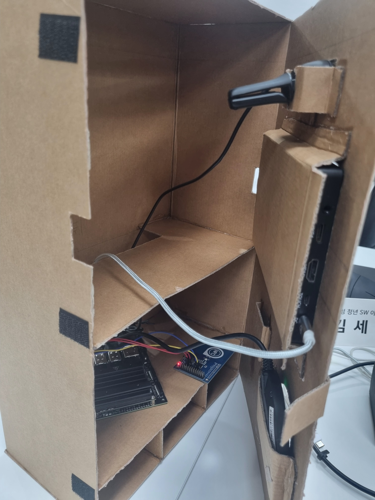
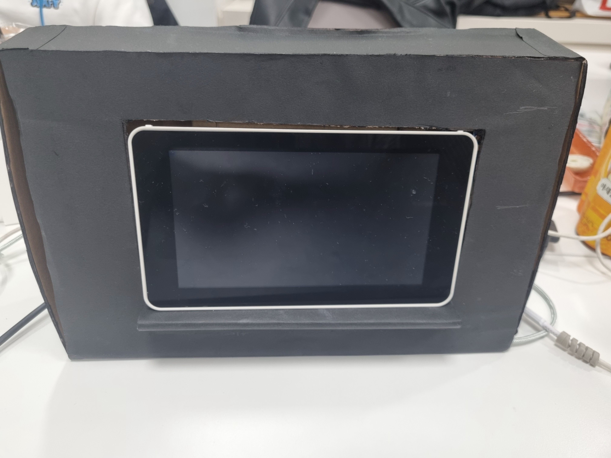
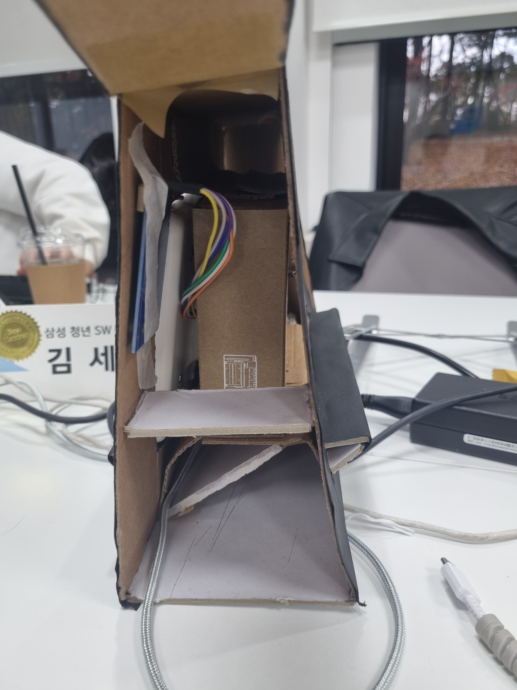
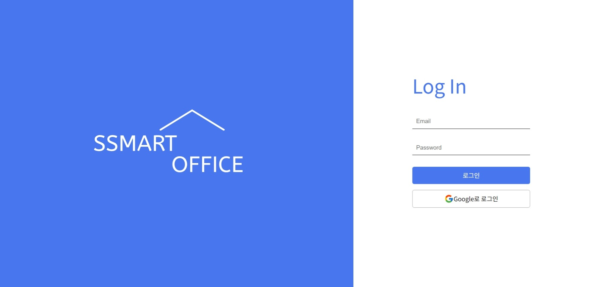
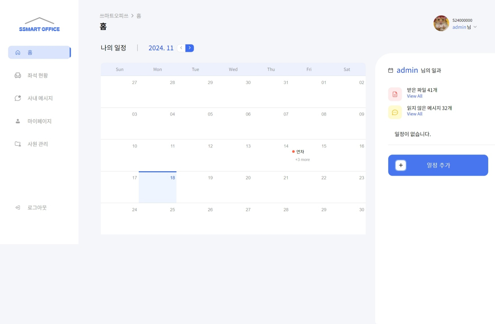
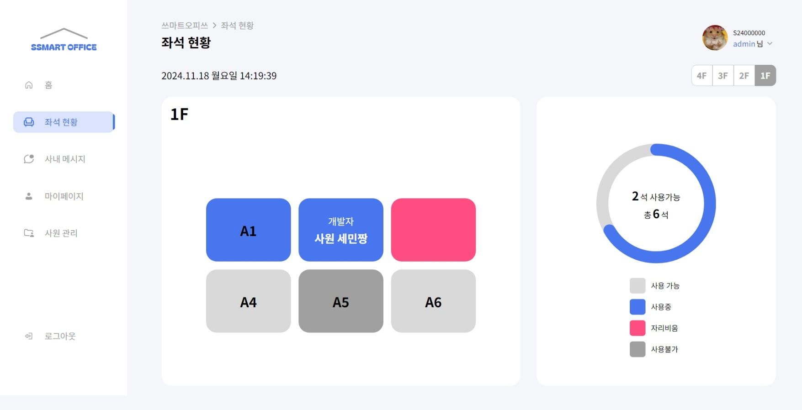
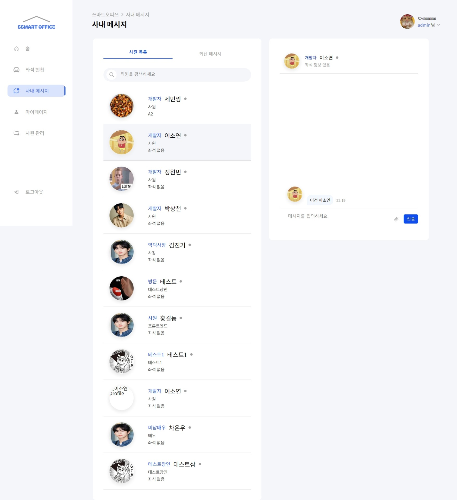
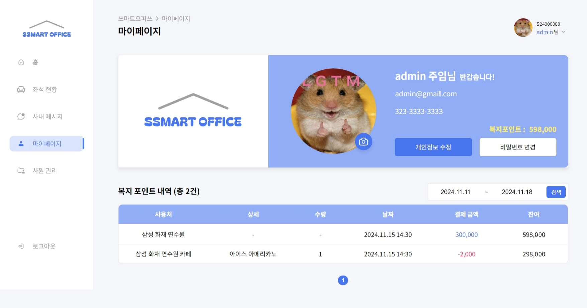
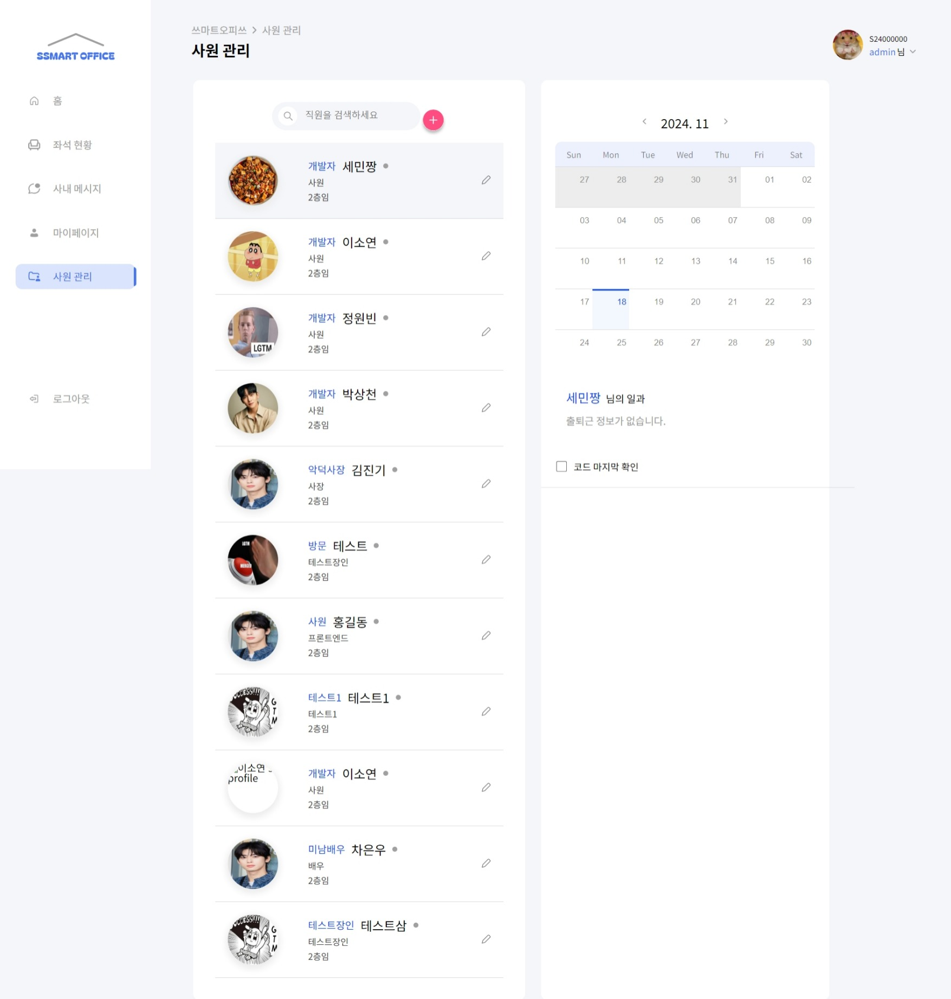

# SSMART OFFICE

## 💡 UCC

## 📑 LOGO

## 🚩 목차

1. 기획 배경
2. 서비스 소개
3. 기능 소개
4. 기술 스택
5. 프로젝트 일정 및 기타 산출물
6. 팀원 소개 및 소감

## ✨ 기획 배경

### 개요

- 한 줄 설명 : 직원 근태 관리부터 회사 복지 포인트까지, 효율적인 인사 관리를 위한 올인원 프로젝트
- 서비스명 : **SSMART OFFICE**

### 목적

- 한 곳에서 다양한 **인사 관리 기능** 제공
- 근태 관리와 **복지 포인트** 통합 관리
- 대시보드를 통한 **실시간 근태 현황 및 기록 조회**
- **관리자 페이지**를 통한 보안 강화 및 효율적 관리

### 현 상황

- HR 성과관리 솔루션 스타트업들 '주목', [업무 방식을 혁신적으로 바꿀 것](https://www.the-stock.kr/news/articleView.html?idxno=17678)
- 인사 관리의 디지털 전환 가속화 [클라우드 기반의 HR 솔루션 도입을 적극 추진](https://brunch.co.kr/%40a2424c82fc944a6/1)

## ✨ 서비스 소개

### 페르소나

- 중소기업 인사 담당자 **정민수** 씨
  - **통합 관리 필요**: 근태 관리, 복지 포인트 지급, 연차 관리 등 다양한 업무를 하나의 시스템에서 처리하고 싶어 한다.

  - **효율적 데이터 관리**: 직원의 근태 현황과 복지 포인트 사용 내역을 실시간으로 확인하고 분석할 수 있는 기능을 원한다.

  - **직관적인 대시보드**: 복잡한 데이터를 시각적으로 쉽게 확인하고 보고서를 작성할 시간을 줄이고 싶어 한다.

  - **보안 강화**: 직원의 민감한 데이터를 안전하게 관리할 수 있는 보안 기능을 중요하게 생각한다.

  - **자동화된 업무 프로세스**: 반복적인 수작업을 줄이고, 휴가 승인 및 복지 포인트 관리 등을 자동화하고 싶어 한다.

### 기대효과

- **업무 효율성 증대**: 근태, 연차, 복지 포인트를 통합적으로 관리함으로써 인사 업무의 효율성을 높임

- **실시간 데이터 활용**: 대시보드와 보고서 기능을 통해 인사 데이터를 실시간으로 분석하고 빠르게 의사 결정을 내릴 수 있음

- **보안 강화**: 민감한 인사 데이터를 안전하게 관리하여 데이터 유출 방지 및 신뢰도 확보

- **직원 만족도 향상**: 체계적인 복지 포인트 관리와 실시간 현황 제공으로 직원들의 복지 체감도를 향상

- **시간 절감**: 자동화된 프로세스를 통해 단순 업무에 소요되는 시간을 절감하고 전략적 업무에 집중 가능

## ✨ 기능 소개

- **근태 관리**
  - **생체 인증**: 얼굴 및 음성 인식을 통해 본인 인증을 강화하여 보안을 향상시킵니다.
  - **대시보드**: 관리자는 모든 직원의 출/퇴근 기록과 일정을 캘린더 형태로 손쉽게 확인할 수 있습니다.
  - **NFC 카드**: 공유 NFC 카드를 사원증처럼 활용하여 퇴근 전까지 편리하게 사용 가능합니다.

- **자율 좌석제** 
  - **NFC 태깅**: 자신의 NFC 카드를 사용하여 원하는 좌석에 태깅하면 사용이 가능합니다.
  - **센서 기반**: 적외선 센서를 활용해 10분 이상 자리를 비울 경우 자동으로 좌석 현황이 업데이트됩니다.
  - **실시간 현황**: 실제 좌석 배치를 기반으로 좌석의 사용 여부를 실시간으로 확인 가능하며, 관리자는 좌석 배치를 수정할 수 있습니다.

- **복지 포인트**
  - **NFC 태깅** : NFC 카드를 활용하여 간편하게 복지 포인트를 사용할 수 있습니다.

- **일정 관리**
  - **캘린더** : 개인 일정은 물론, 관리자는 모든 직원의 일정을 한눈에 확인할 수 있습니다.
  - **간편한 일정 관리** : 모달 창을 통해 일정을 쉽게 추가하거나 삭제할 수 있습니다.

- **사내 메시지**
  - **메신저** : 사내 직원들과 실시간으로 메시지 및 파일을 주고받을 수 있습니다.
  - **메시지 및 파일 관리** : 읽지 않은 메시지와 수신한 파일을 한곳에 정리하여 빠르게 찾을 수 있습니다.
  - **좌석 및 현재 상황** : 상대 직원의 현재 상태와 좌석 정보를 확인할 수 있습니다.

- **사용자 & 관리자**
  - **관리자 모드** : 사원을 추가하거나 모든 사원의 근태 관리 및 좌석 배치를 수정할 수 있습니다.
  - **로그인 & 로그아웃** : JWT Token을 사용하여 안전한 로그인 및 로그아웃이 가능합니다.

## ✨ 기술 스택

- **프론트엔드** : React, TypeScript, Vite, Tailwind, React Context, react-datepicker, SSE
- **백엔드** : Spring, Spring Security, JWT, JPA, SSE
- **인프라** : Docker, Nginx, Jenkins, MySQL, Redis, Kafka, MongoDB, Certbot, AWS EC2
- **AI** : 
  - 탐지 : YoloV5(최종 선정), Yoloworld
  - 분류 : MobileNetV4(최종 선정), Inception-ResNet-v2, DenseNet128, Resnet, MobileNetV3, Google Net
  - 분석 : YoloV8(최종 선정), Swin-transformer, Swin-Detr
- **HW** : YoloV5(객체 탐지), Arduino, S3
- **이슈 관리** : Git Lab, JIRA, Mattermost, Notion, Figma

## ✨ 아키텍처 설계도

## ✨ 프로젝트 일정 및 기타 산출물

### 프로젝트 일정

**전체 일정** : 2024.10.14 ~ 2024.11.19(총 37일)

- **기획** : 2024.10.14 ~ 2024.10.20(총 7일)
- **개발** : 2024.10.21 ~ 2024.11.19(총 30일)

### Git Flow

### 기능 명세서

### 피그마 화면 정의서

### ERD

### API 명세서

<table border=1>
  <tr>
    <td></td>
    <td></td>
    <td></td>
    <td></td>
  </tr>
  <tr>
    <td></td>
    <td></td>
    <td></td>
    <td></td>
  </tr>
</table>

## ✨ HW

<table>
  <tr>
    <td colspan="2" align="center">
      
    </td>
  </tr>
  <tr>
    <td></td>
    <td></td>
  </tr>
  <tr>
    <td></td>
    <td></td>
  </tr>
</table>

## ✨ 화면

|  |  |
|:-------------------------------------:|:-------------------------------------:|
|               로그인                 |               홈페이지                |
|    |     |
|               좌석                   |               채팅                    |
|  |    |
|             마이페이지               |               유저                    |

## ✨ 소감

|                      이름                      |      역할       | 소감                                                                                                                                                                                                                                                                                                                                                                                                                                                                 |
| :--------------------------------------------: | :-------------: | -------------------------------------------------------------------------------------------------------------------------------------------------------------------------------------------------------------------------------------------------------------------------------------------------------------------------------------------------------------------------------------------------------------------------------------------------------------------- |
|   김진기  |    팀장(AI/HW)     | 첫 프로젝트 팀장으로서 진행에 있어서 많은 부족함이 있었지만 잘 따라와준 팀원들에게 고맙고, 그 어느 팀들보다 자기주도적으로 열심히 참여한 팀이라고 자부합니다.   프로젝트 설정부터 DB설계, 보안 설정 등 백엔드와 관련한 모든 사항에 대해서 기획부터 설계를 담당할 수 있어 좋았습니다.  특히 JPA와 Security, JWT 등 기초적인 보안 파트와 DB 로직 설계에 대해 역량을 기를 수 있었고, SSE를 활용한 실시간 통신을 구현했습니다.  다음 기회에는 저장 데이터를 빠르고 안정적이게 업데이트 할 수 있는 방식에 대해 학습하고자 합니다.                                                                                                                    |
|    정원빈 |     FE     | Figma부터 리액트 코드까지 전반적인 부분들을 처음으로 대표로 맡게 되어 디자인, 코드 부분에 있어서 부담스럽고 긴장이 되었습니다.   하지만 걱정했던 부분에서 팀원분들이 괜찮다고 해주셔서 조금 자신감을 얻어서 작업을 차근차근 진행할 수 있었고 구현하기 원했던 기능들을 완성할 수 있었습니다.   다른 부분을 걱정하지 않고 Front End 부분에 집중할 수 있도록 해준 팀원분들께 감사드립니다...!                                                                                                                                        |
|    이소연  | FE | 이번 프로젝트에서 AI 실시간 처리 공정에 맞는 인프라 환경을 구축하며, 도메인의 특성에 따라 인프라 구조가 달라진다는 중요한 교훈을 얻었습니다.  또한, SSE를 통해 실시간 분석 결과를 클라이언트로 전송하는 과정에서 발생한 오류를 해결하며 Nginx의 buffering 기능을 알게 되었고, 기술을 사용할 때는 그 기술에 대한 깊은 이해가 필요하다는 점을 다시 한 번 느꼈습니다.   AI라는 새로운 분야에 도전하면서, 모델의 정확도를 높이기 위해 배치 사이즈, 에폭, 학습률, 전이 학습, 모델 수정 등을 직접 조정하며 AI의 기초 지식과 역량을 쌓을 수 있었습니다.  이 경험은 향후 AI가 포함된 프로젝트를 진행할 때 프로젝트의 전반적인 이해도를 높이는 데 큰 도움이 될 것이라고 생각합니다.   비록 여러 오류와 새로운 분야에서의 도전이 쉽지 않았지만, 팀원들과의 소통과 협업을 통해 문제를 해결하며 좋은 결과물을 만들어낼 수 있었습니다.  이번 프로젝트를 통해 개발자로서 한 단계 성장하는 소중한 기회가 되었습니다. |
|    이동복 |     BE      | 이번 프로젝트에서는 스마트 팩토리에서 사용할 수 있는 불량 탐지 시스템 개발에 중점을 두었습니다.   목표는 다양한 제품에서 불량을 실시간으로 높은 정확도로 탐지하고 분석할 수 있는 시스템을 구축하는 것이었습니다.   탐지 단계에서는 YoloV5 모델을 활용해 실시간 성능과 정확도에서 우수한 결과를 얻었으며, 이를 통해 실제로 발생할 수 있는 제품의 불량을 빠르게 탐지할 수 있었습니다.   불량 분류 단계에서는 MobileNetV4를 적용해 속도와 정확도를 균형 있게 유지할 수 있었습니다.   이후, 분석 단계에서는 YoloV8 모델을 사용해 더욱 세밀한 결함을 찾아내는 성능을 강화했습니다.   이 과정에서 InceptionV5, DenseNet128, MobileNetV4, Swin Transformer, Swin Detr 등 다양한 AI 모델들을 실험하며 최적의 성능을 탐구했습니다.  실제 데이터셋 처리와 라벨링 작업 등 실무에서 필요한 여러 과정들을 거쳐 시스템을 구축할 수 있었고, 데이터셋이 부족한 상황에 대비한 분석 방법도 모색했습니다.   이번 프로젝트를 통해 스마트 팩토리 내 불량 탐지 시스템 개발에 대한 깊은 이해와 경험을 쌓을 수 있었고, 각 모델의 특성을 비교하며 프로젝트 요구 사항에 적합한 최적의 솔루션을 도출하는 데 성공했습니다.                                                                                                                                                           |
|    김세민  |       BE        | 특화라는 이름에 걸맞게 AI 기술에 치중했던 프로젝트였습니다.   패키지 버전 충돌, 기대 이하의 성능 등 AI를 다루는 데 있어 많은 어려움이 있었습니다.  하지만 그 문제들을 해결하고 제어하여 결국 원하는 결과물을 만들어 내는 AI의 묘미를 느낄 수 있던 프로젝트였습니다.  또 그 과정에서 GPU 서버와 프론트엔드, 백엔드의 소통 방식을 배우고 알아가는 재미를 느낄 수 있었습니다.   이 프로젝트를 통해 AI 기술을 다루는 역량이 한 층 더 성장시킬 수 있어 좋았습니다.   특화라는 이름에 걸맞게 AI 기술에 치중했던 프로젝트였습니다.   패키지 버전 충돌, 기대 이하의 성능 등 AI를 다루는 데 있어 많은 어려움이 있었습니다.  하지만 그 문제들을 해결하고 제어하여 결국 원하는 결과물을 만들어 내는 AI의 묘미를 느낄 수 있던 프로젝트였습니다.  또 그 과정에서 GPU 서버와 프론트엔드, 백엔드의 소통 방식을 배우고 알아가는 재미를 느낄 수 있었습니다.   이 프로젝트를 통해 AI 기술을 다루는 역량이 한 층 더 성장시킬 수 있어 좋았습니다.  |
|    박상천  |       Infra        | 기존 팀의 사정으로 중간에 팀에 합류하게 되었는데, 팀원 분들이 많이 도와주셔서 미약하지만 조금이나마 기여를 할 수 있어 다행이었다고 생각합니다.  한 달 남짓의 짧은 시간이었지만, 유능한 팀원들과 함께 프로젝트를 진행하며 많은 것을 배웠고, 덕분에 만족스러운 결과물이 나왔다고 생각합니다.                                                                                                                                                                                                                                                               |